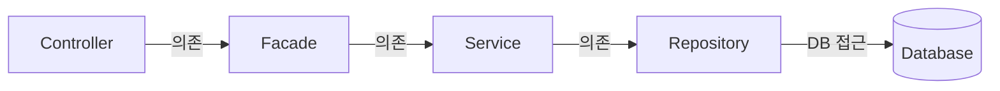
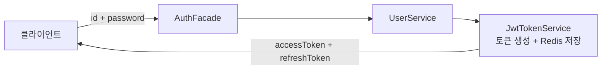
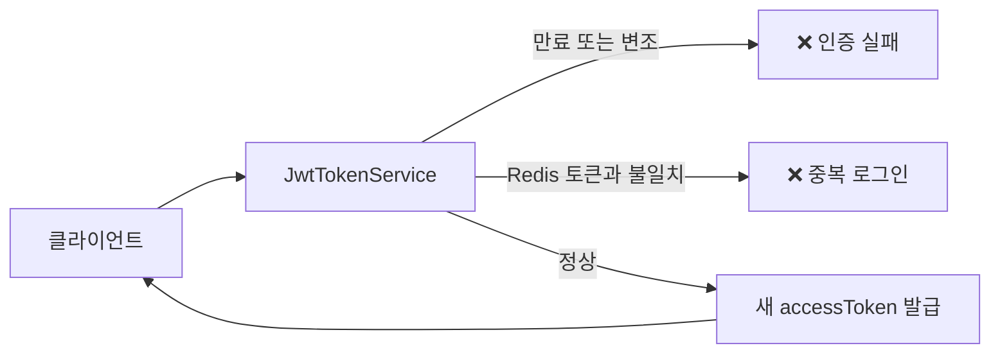
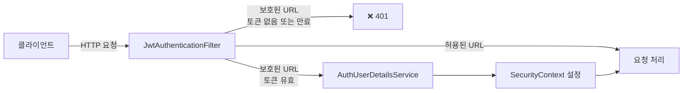
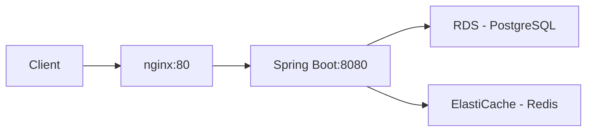
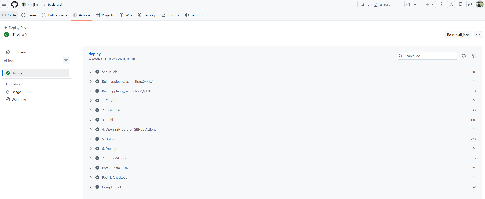

# Basic-Arch

> 순환참조 없는 레이어드 아키텍처 + 공통 인프라를 제공하는 **Spring Boot 백엔드 개발 표준화 프레임워크**


---

## 1. 의도

실무에서 반복적으로 마주쳤던 두 가지 문제를 해결하기 위해 시작했습니다.

### 문제 1 — 보일러플레이트와 통일성 부재

새 프로젝트가 시작될 때마다 이력 필드, API 응답 포맷, 검색 파라미터, 메서드 시그니처를 매번 다시 작성했습니다. 개발자마다 구현 방식이 달라 코드를 파악하는 데만 시간이 걸렸습니다.

```java
{code:200,data:{...}}

        {status:"success",data:{...}}

```

### 문제 2 — 서비스 레이어 순환참조 및 Self-Invocation 방지

실무에서 두 가지 규칙을 모두 적용해봤는데, 둘 다 문제가 있었습니다.

| 규칙                 | 문제                                 |
|--------------------|------------------------------------|
| **서비스 간 직접 호출 허용** | 프로젝트 규모가 커질수록 의존 관계가 얽혀 순환참조 에러 발생 |
| **서비스 간 직접 호출 금지** | 필요한 로직을 호출 못하니 같은 코드를 여러 곳에 중복 작성  |

> Facade 레이어를 추가

Service는 서로를 모르고, 로직 조합이 필요하면 Facade에서 여러 Service를 조합해 처리합니다.

---

## 2. 아키텍쳐 설계

### 레이어드 + Facade 패턴

[파사드 패턴이란?](https://medium.com/@harshitha.khandelwal/facade-design-pattern-explained-f8c8be035086)

**Facade 패턴을 선택한 이유**

- 서비스 간 순환 참조 방지

> 서비스 안에 다른서비스를 호출하는 걸 근본적으로 차단하여, 순환 참조가 구조적으로 절대 발생할 수 없음

- Bean Validation 대신 [ToyAssert](src/main/java/com/example/basicarch/base/exception/ToyAssert.java)를 Facade에서 처리와 검증

> 입력, 비즈니스 검증이 Facade 레이어 한 곳에 모여 있어, 유지보수가 용이함

- Self-Invocation 방지

> 서비스에 이미 단일 비즈니스 로직이 구현되어있어 AOP 프록시 우회로 인한, Self-Invocation 방지를 통해 정상적인 트랜잭션 롤백을 수행



|                | 가능한것                                        | 안되는것                                            |
|----------------|---------------------------------------------|-------------------------------------------------|
| **Controller** | Facade 의존, 사용자 요청, 응답 반환                    | 검증 로직, 직접 Service 호출                            |
| **Facade**     | Service 의존, 입력값 검증, 예외 처리, 트랜잭션, 비즈니스 로직 조합 | Repository 직접 접근, HTTP 관련 코드                    |
| **Service**    | Repository의존, 단일 도메인 비즈니스 로직                | Repository 직접 접근, 예외, HTTP 관련 코드, 다른 Service 의존 |
| **Repository** | DB 접근, Query                                | 비즈니스 로직                                         |

### 프로젝트 공통 구조 - Base Class ###

| 클래스                                                                                    | 역할                                      |
|----------------------------------------------------------------------------------------|-----------------------------------------|
| [BaseService](src/main/java/com/example/basicarch/base/service/BaseService.java)       | 모든 Service가 구현하는 인터페이스. 동일한 메서드 시그니처 강제 |
| [BaseEntity](src/main/java/com/example/basicarch/base/model/BaseEntity.java)           | PK 체계 단일화, 생성일/수정일 이력 필드 자동화            |
| [BaseModel](src/main/java/com/example/basicarch/base/model/BaseModel.java)             | Facade/Controller 계층에서 사용하는 DTO 기반 클래스  |
| [BaseSearchParam](src/main/java/com/example/basicarch/base/model/BaseSearchParam.java) | 검색 조건 공통 파라미터 규격화                       |

### Entity / Model 분리

- **Entity** (`extends BaseEntity<Long>`): JPA 영속성 객체, DB와 직접 매핑하는 객체
- **Model** (`extends BaseModel<Long>`): Facade/Controller 계층에서 주고받는 객체
- **Converter** (MapStruct): 양방향 변환 (`toModel` / `toEntity`)

---

## 3. 아키텍쳐

## 기술 스택

| 분류       | 기술                                           |
|----------|----------------------------------------------|
| 언어 / 플랫폼 | Java 21, Spring Boot 3.5, Gradle             |
| 데이터 접근   | Spring Data JPA, QueryDSL, Flyway            |
| 매핑       | MapStruct, Lombok                            |
| 인증 / 보안  | Spring Security, JWT                         |
| 캐시       | Spring Cache(Caffeine), Redis Pub/Sub, Kafka |
| 토큰 저장소   | Redis (Refresh Token)                        |
| 데이터베이스   | PostgreSQL 15                                |
| API 문서   | SpringDoc OpenAPI (Swagger UI)               |
| 로컬 인프라   | [Docker Compose](docker-compose.yml)         |
| 모니터링     | Prometheus, Grafana, Actuator                |
| 클라우드     | AWS EC2, RDS(PostgreSQL), ElastiCache(Redis) |
| CI/CD    | GitHub Actions                               |

### 프로젝트 구조

```
src/main/java/com/basicarch/
├── base/        공통 인프라 (annotation, cache, component, constants, exception, model, redis, security, utils)
│   └── cache/   캐시 아키텍처 (CacheEventPublisher, redis/, kafka/, spring/)
├── config/      Spring 설정 (Security, Cache, Redis, Kafka, Swagger, advice, interceptor, listener, scheduler)
└── module/
    ├── user/    사용자, 역할, 인증
    ├── code/    공통 코드/코드그룹
    ├── menu/    메뉴 관리
    └── file/    파일 업로드/다운로드
```

각 모듈은 `controller / facade / service / repository / converter / entity / model` 구조를 따릅니다.

### 공통 유틸리티

| 클래스                                                                                    | 주요 기능                                                 |
|----------------------------------------------------------------------------------------|-------------------------------------------------------|
| [StringUtils](src/main/java/com/example/basicarch/base/utils/StringUtils.java)         | isBlank/isEmpty, masking, lpad/rpad, regex, 포맷        |
| [DateUtils](src/main/java/com/example/basicarch/base/utils/DateUtils.java)             | LocalDateTime-Date-String 변환, 요일, 날짜 연산               |
| [CollectionUtils](src/main/java/com/example/basicarch/base/utils/CollectionUtils.java) | safeStream, merge, separationList, toMap, extractList |
| [CryptoUtils](src/main/java/com/example/basicarch/base/utils/CryptoUtils.java)         | 랜덤 문자열 생성, SecretKey 생성                               |
| [SessionUtils](src/main/java/com/example/basicarch/base/utils/SessionUtils.java)       | SecurityContext에서 현재 사용자 정보 조회                        |
| [CommonUtils](src/main/java/com/example/basicarch/base/utils/CommonUtils.java)         | HTTP 응답 직접 쓰기, JWT 디코딩                                |

## 4. 기능

### 인증 흐름 — 로그인



### 인증 흐름 — AccessToken 재발급



> [RefreshTokenStore](src/main/java/com/example/basicarch/base/security/jwt/token/RefreshTokenStore.java)는 인터페이스로 추상화되어
> 있어 Redis 외 다른 저장소로 교체 가능합니다.

### 인증 흐름 — 요청 인증



### Redis 캐시 전략

| 캐시            | key:value           | 무효화 방식                   |
|---------------|---------------------|--------------------------|
| Code 캐시       | code::all           | Redis Pub/Sub, Kafka     |
| Menu 캐시       | menu::all           | Redis Pub/Sub, Kafka     |
| Refresh Token | jwt:refresh:loginId | 로그아웃/재로그인 시 삭제 및 TTL로 관리 |

### API 응답 형식

module 디렉터리 범위 안의 모든 응답은 [ResponseAdvice](src/main/java/com/example/basicarch/config/advice/ResponseAdvice.java)
를 통해 [Response<T>](src/main/java/com/example/basicarch/base/model/Response.java)로 래핑

```java
public static <T> Response<T> fail(int status, String error, String message) {
    return Response.<T>builder()
            .status(status)
            .error(error)
            .message(message)
            .build();
}

public static <T> Response<T> fail(int status, String message) {
    return Response.<T>builder()
            .status(status)
            .message(message)
            .build();
}
```

### 주요 모듈

**user - 사용자**

Spring Security + JWT 기반 인증. `Role / UserRole / User` 구조로 권한을 관리하고, Redis에 Refresh Token을 저장해 체크합니다.

**code - 공통 코드**

`CodeGroup → Code` 1:N 계층으로 코드를 관리한다. code 값 없이 저장하면 자동으로 001, 002..., N 채번되고, 변경 시 리스너를 통한 캐시 무효화를 이용합니다.

**menu - 메뉴**

`id`와 `parentId` 를 이용한 트리 구조. DB에서 가져온 후 서버에서 트리로 조립합니다.

**file - 파일**

refPath(테이블명) + refId(PK) 조합으로 어느 도메인에나 파일을 붙일 수 있습니다.

---

## 5. 실행 가이드

요구 사항: JDK 21, Docker(Windows는 WSL2 필요)

| 프로필     | 포트   |
|---------|------|
| `local` | 8085 |
| `dev`   | 8080 |
| `prod`  | 8080 |

### local 환경

Docker가 설치되어 있으면 프로젝트만 구동하면 됩니다. 프로젝트 구동
시, [LocalDockerConfig](src/main/java/com/example/basicarch/config/LocalDockerConfig.java)에서 프로젝트 인프라를 자동으로 세팅해줍니다.


### 접속 정보

- Swagger UI: http://localhost:8085/swagger-ui/index.html
- Prometheus: http://localhost:19090
- Grafana: http://localhost:13000

### Swagger UI ###


### Grafana ###


### 배포

> 현재는 dev 브랜치 push 시 GitHub Actions가 자동으로 빌드 후 EC2에 배포합니다.

### A. AWS EC2 + GitHub Actions





---

~~### B. Railway~~

~~~~

## 6. 설계 결정

### JWT & Refresh Token

Redis에 저장하여, 토큰 탈취 시 토큰 삭제로 인해 즉시 무효화하거나, 중복 로그인 방지

---

### 캐시 무효화 전략

#### 참조: [Spring 캐시(Cache)와 Redis / 코딩하는오후](https://www.youtube.com/watch?v=7vNTDkqMLUw)

Spring Cache를 사용하며, 두 가지 방식으로 캐시를 관리합니다.

```shell
docker exec -it basic-arch-redis redis-cli subscribe cache:invalidate
```

**Redis Pub/Sub — 데이터 변경 시 즉시 무효화**

```
@CacheInvalidate(CacheType.CODE)
```

---

## 7. 로드맵

| 순서 | 기술                   | 학습 내용                                          | 상태  |
|----|----------------------|------------------------------------------------|-----|
| 1  | Prometheus + Grafana | Actuator 메트릭 수집, 대시보드 구성                       | 완료  |
| 2  | AWS + ElastiCache    | EC2 배포, RDS(PostgreSQL), ElastiCache(Redis) 연동 | 완료  |
| 3  | Kafka                | Redis Pub/Sub → Kafka 전환, 캐시 publisher 추상화     | 진행중 |
| 4  | 이커머스구현               | 현재 프로젝트 기반, Kafka 연동 주문/결제/재고, 동시성 제어          | 진행중 |
| 5  | Kubernetes           | minikube로 현재 프로젝트 배포, 및 실습                     | 대기  |
